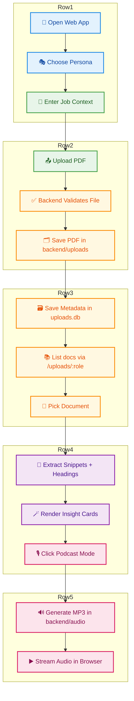
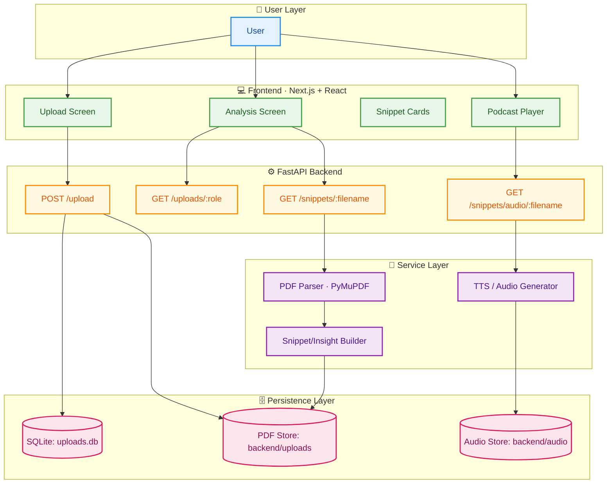
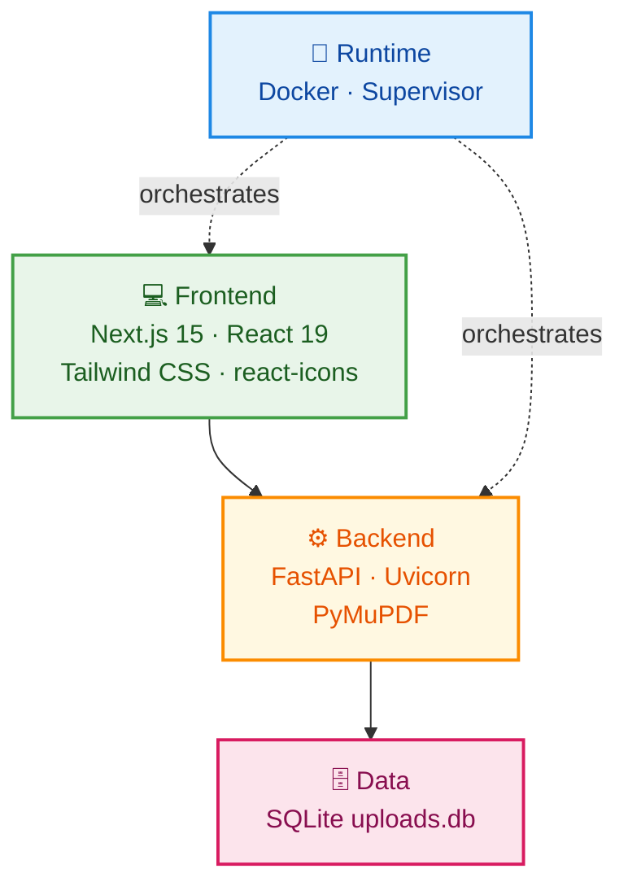
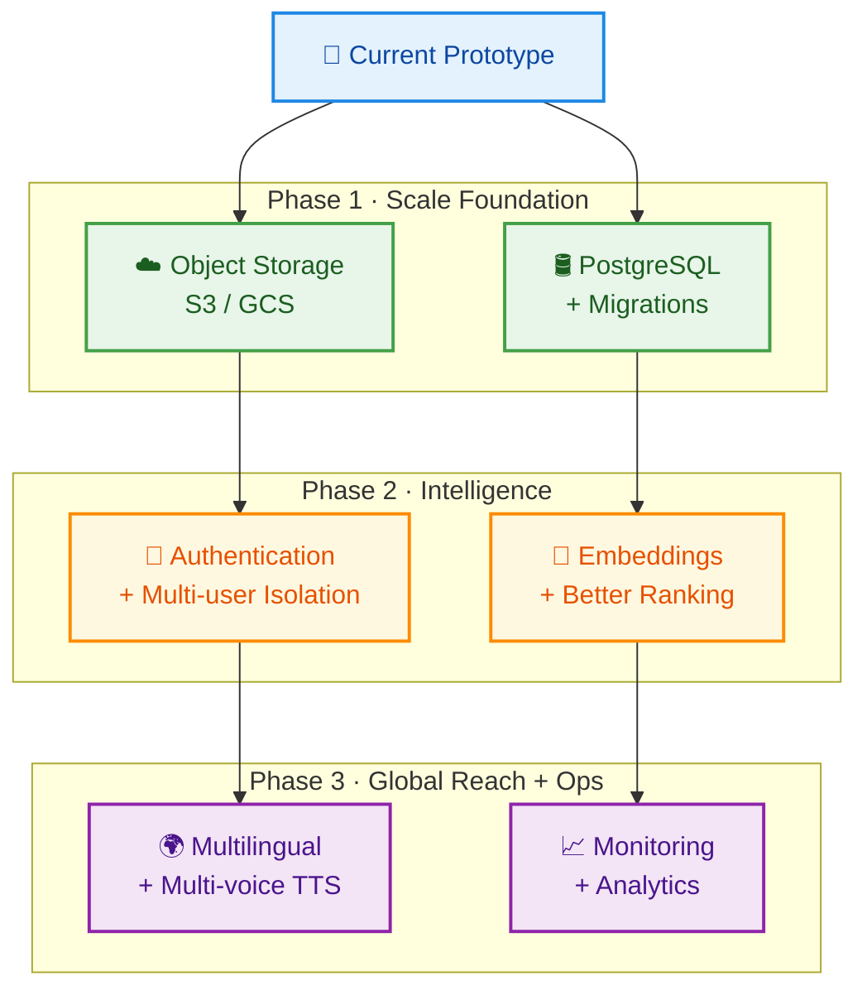

<div align="center">

# 🚀 Adobe Hackathon 2025
### <i>Intelligent PDF Insight & Podcast Generator</i>

<p>
  
  
  
  
  
</p>

<p>
  <b>📄 Smart PDF Ingestion</b> &nbsp;•&nbsp;
  <b>🧠 Role-Aware Insight Extraction</b> &nbsp;•&nbsp;
  <b>🔊 Podcast-Style Briefings</b> &nbsp;•&nbsp;
  <b>⚡ Fast Review Workflow</b>
</p>

<br/>

<table>
  <tr>
    <td align="center"><b>⚡ Fast UX</b><br/>Upload once, analyze in seconds.</td>
    <td align="center"><b>🎯 Persona Aware</b><br/>Role-specific retrieval and context.</td>
    <td align="center"><b>🔊 Dual Consumption</b><br/>Read snippets or listen as audio.</td>
  </tr>
</table>
</div>


## 📚 Table of Contents
1. [🌟 Executive Summary](#-executive-summary)
2. [🧭 Product Journey Flowchart](#-product-journey-flowchart-detailed)
3. [🧱 System Architecture](#-system-architecture-beautiful-overview)
4. [🛠️ Tech Stack](#️-tech-stack)
5. [📁 Project Structure](#-project-structure)
6. [🔌 API Reference](#-api-reference-detailed)
7. [🚀 Local Development](#-local-development)
8. [🐳 Deployment Options](#-deployment-options)
9. [🧪 Quality Checks & Validation Flow](#-quality-checks--validation-flow)
10. [🔮 Future Enhancements Roadmap](#-future-enhancements-roadmap)
   
---

## 🌟 Executive Summary

Long PDFs are difficult to consume quickly. This project creates a **dual-consumption experience**:

- 📄 **Read mode**: browse extracted snippets and likely key sections.
- 🔊 **Listen mode**: convert those snippets into an MP3 summary.
- 🎭 **Persona-aware context**: upload and retrieve files by role/use-case.

### One-line product promise

```text
Upload PDFs → Extract role-specific insights → Listen as an audio briefing
```

---

## 🧭 Product Journey Flowchart (Detailed)


```mermaid
flowchart TB

    subgraph Row1
    direction LR
    A[👤 Open Web App] --> B[🎭 Choose Persona] --> C[🧾 Enter Job Context]
    end

    subgraph Row2
    direction LR
    D[📤 Upload PDF] --> E[✅ Backend Validates File] --> F[🗂️ Save PDF in backend/uploads]
    end

    C --> D

    subgraph Row3
    direction LR
    G[🗃️ Save Metadata in uploads.db] --> H[📚 List docs via /uploads/:role] --> I[📖 Pick Document]
    end

    F --> G

    subgraph Row4
    direction LR
    J[🧠 Extract Snippets + Headings] --> K[🪄 Render Insight Cards] --> L[🎙️ Click Podcast Mode]
    end

    I --> J

    subgraph Row5
    direction LR
    M[🔊 Generate MP3 in backend/audio] --> N[▶️ Stream Audio in Browser]
    end

    L --> M

    classDef user fill:#E3F2FD,stroke:#1E88E5,color:#0D47A1,stroke-width:2px;
    classDef input fill:#E8F5E9,stroke:#43A047,color:#1B5E20,stroke-width:2px;
    classDef backend fill:#FFF8E1,stroke:#FB8C00,color:#E65100,stroke-width:2px;
    classDef insight fill:#F3E5F5,stroke:#8E24AA,color:#4A148C,stroke-width:2px;
    classDef audio fill:#FCE4EC,stroke:#D81B60,color:#880E4F,stroke-width:2px;

    class A,B user;
    class C,D input;
    class E,F,G,H,I backend;
    class J,K insight;
    class L,M,N audio;
```

## 🎨 Stage-by-Stage Explanation Table

| Stage | What happens | Why it matters | Output |
|---|---|---|---|
| 👤 App entry | User opens the frontend interface. | Starts a guided workflow instead of a raw uploader. | Ready UI state |
| 🎭 Persona selection | User chooses role/persona context. | Keeps analysis use-case specific. | Role tag |
| 📤 Upload | PDF file is submitted with metadata. | Binds content with intent (role + job desc). | File payload |
| ✅ Validation | FastAPI checks file and request format. | Prevents invalid uploads early. | Accepted request |
| 🗂️ File persistence | PDF saved under `backend/uploads/`. | Keeps original source available for re-analysis. | Stored PDF |
| 🗃️ Metadata save | Filename/role/jobdesc/timestamp saved in SQLite. | Enables role-filtered retrieval and history. | DB record |
| 📚 Retrieval | Frontend fetches documents using role endpoint. | Users can quickly find relevant docs. | Role-specific list |
| 🧠 Extraction | Snippet engine parses PDF text using PyMuPDF. | Converts long documents into digestible chunks. | Structured snippets |
| 🪄 Presentation | Frontend renders cards with concise insight text. | Improves scanning speed and readability. | Insight dashboard |
| 🎙️ Audio generation | Backend synthesizes snippet narration. | Supports hands-free consumption. | MP3 file URL |
| ▶️ Playback | Browser audio player streams the MP3. | Final user experience: listen on demand. | Audio briefing |

---

## 🧱 System Architecture (Beautiful Overview)


```mermaid
flowchart TB
    subgraph USER[👥 User Layer]
        U[User]
    end

    subgraph FE[💻 Frontend · Next.js + React]
        FE1[Upload Screen]
        FE2[Analysis Screen]
        FE3[Snippet Cards]
        FE4[Podcast Player]
    end

    subgraph API[⚙️ FastAPI Backend]
        A1[POST /upload]
        A2[GET /uploads/:role]
        A3[GET /snippets/:filename]
        A4[GET /snippets/audio/:filename]
    end

    subgraph SRV[🧠 Service Layer]
        S1[PDF Parser · PyMuPDF]
        S2[Snippet/Insight Builder]
        S3[TTS / Audio Generator]
    end

    subgraph STORE[🗄️ Persistence Layer]
        DB[(SQLite: uploads.db)]
        FS1[(PDF Store: backend/uploads)]
        FS2[(Audio Store: backend/audio)]
    end

    U --> FE1
    U --> FE2
    U --> FE4

    FE1 --> A1
    FE2 --> A2
    FE2 --> A3
    FE4 --> A4

    A1 --> DB
    A1 --> FS1
    A3 --> S1 --> S2 --> FS1
    A4 --> S3 --> FS2

    classDef user fill:#E3F2FD,stroke:#1E88E5,color:#0D47A1,stroke-width:2px;
    classDef frontend fill:#E8F5E9,stroke:#43A047,color:#1B5E20,stroke-width:2px;
    classDef api fill:#FFF8E1,stroke:#FB8C00,color:#E65100,stroke-width:2px;
    classDef service fill:#F3E5F5,stroke:#8E24AA,color:#4A148C,stroke-width:2px;
    classDef store fill:#FCE4EC,stroke:#D81B60,color:#880E4F,stroke-width:2px;

    class U user;
    class FE1,FE2,FE3,FE4 frontend;
    class A1,A2,A3,A4 api;
    class S1,S2,S3 service;
    class DB,FS1,FS2 store;
```

## 🧩 Component Deep-Dive (Detailed)

| Component | Responsibility | Key Strength | Related Paths |
|---|---|---|---|
| 💻 Frontend (Next.js) | Handles upload UX, analysis view, and playback controls. | Fast and interactive UI for scanning insights. | `frontend/app`, `frontend/services` |
| ⚙️ API Routes (FastAPI) | Receives uploads, lists files, extracts snippets, generates audio. | Clear endpoint-driven architecture. | `backend/app/main.py`, `backend/app/routers` |
| 🧠 PDF Insight Services | Parses PDFs and builds snippet-level output. | Converts dense docs into readable chunks. | `backend/app/services`, `backend/app/utils` |
| 🔊 Audio Service | Turns snippet text into MP3 narration. | Enables read + listen dual mode. | `backend/app/generate_audio.py`, `backend/audio` |
| 🗃️ SQLite Metadata | Stores role/job/file tracking metadata. | Lightweight and hackathon-friendly persistence. | `backend/uploads.db` |
| 🗂️ File Storage | Stores original PDFs and generated MP3 artifacts. | Simple, transparent local storage model. | `backend/uploads`, `backend/audio` |

---

## ✨ Feature Matrix

| Feature | Description | User Benefit |
|---|---|---|
| 🎭 Persona-aware uploads | Uploads are tagged by role and context. | More relevant retrieval and review. |
| 📂 Role-based listing | Files fetched by role endpoint. | Easier organization by use-case. |
| 🧠 Snippet extraction | Pulls concise text segments from pages. | Faster comprehension than full reading. |
| 🔊 Podcast mode | Generates audio from extracted text. | Hands-free content consumption. |
| 📎 Static serving | PDF/MP3 assets served via backend routes. | Smooth preview and playback experience. |
| 🐳 Docker-friendly runtime | Can run as one containerized stack. | Easier demo and deployment setup. |

---

## 🛠️ Tech Stack


```mermaid
flowchart TB
    FE[💻 Frontend\nNext.js 15 · React 19\nTailwind CSS · react-icons]
    BE[⚙️ Backend\nFastAPI · Uvicorn\nPyMuPDF]
    DATA[🗄️ Data\nSQLite uploads.db]
    DEVOPS[🚀 Runtime\nDocker · Supervisor]

    FE --> BE --> DATA
    DEVOPS -. orchestrates .-> FE
    DEVOPS -. orchestrates .-> BE

    classDef frontend fill:#E8F5E9,stroke:#43A047,color:#1B5E20,stroke-width:2px;
    classDef backend fill:#FFF8E1,stroke:#FB8C00,color:#E65100,stroke-width:2px;
    classDef data fill:#FCE4EC,stroke:#D81B60,color:#880E4F,stroke-width:2px;
    classDef runtime fill:#E3F2FD,stroke:#1E88E5,color:#0D47A1,stroke-width:2px;

    class FE frontend;
    class BE backend;
    class DATA data;
    class DEVOPS runtime;
```

| Layer | Technologies |
|---|---|
| Frontend | Next.js 15, React 19, Tailwind CSS, react-icons |
| Backend | FastAPI, Uvicorn, PyMuPDF (`fitz`) |
| Data | SQLite (`uploads.db`) |
| Runtime | Docker, Supervisor |

---

## 📁 Project Structure

```text
Adobe-Hackathon-2025/
├── backend/
│   ├── app/
│   │   ├── main.py
│   │   ├── generate_audio.py
│   │   ├── routers/
│   │   ├── services/
│   │   └── utils/
│   ├── uploads/              # runtime PDFs
│   ├── audio/                # runtime MP3s
│   ├── uploads.db            # SQLite metadata
│   └── requirements.txt
├── frontend/
│   ├── app/
│   ├── services/
│   └── package.json
├── Dockerfile
├── supervisord.conf
└── README.md
```

## 📚 Structure Explanation Table

| Path | Purpose |
|---|---|
| `backend/app/main.py` | Main API application setup, routes wiring, and service orchestration. |
| `backend/app/routers/` | Route modules for specific domains (upload/snippet/persona/podcast flows). |
| `backend/app/services/` | Business logic for extraction, persona processing, and TTS support. |
| `backend/app/utils/` | Shared helpers for file and PDF handling. |
| `backend/uploads/` | Uploaded source PDF documents. |
| `backend/audio/` | Generated podcast-style MP3 files. |
| `backend/uploads.db` | Metadata persistence (role, filename, jobdesc, timestamp). |
| `frontend/app/` | Main UI pages and route-level components. |
| `frontend/services/` | API helper methods used by UI layers. |

---

## 🔌 API Reference (Detailed)

Base URL (local): `http://127.0.0.1:8000`

| Method | Endpoint | Purpose | Input | Output |
|---|---|---|---|---|
| `POST` | `/upload` | Upload PDF with persona metadata | `multipart/form-data` (`file`, `role`, `jobdesc`) | Confirmation + filename |
| `GET` | `/uploads/{role}` | Fetch files by role | `role` path param | Role-filtered file list |
| `GET` | `/snippets/{filename}` | Extract snippets from chosen file | `filename` path param | Snippet objects |
| `GET` | `/snippets/audio/{filename}` | Generate audio from snippets | `filename` path param | MP3 URL payload |
| `GET` | `/pdfs/<filename>` | Serve uploaded PDF | filename path | Binary/stream response |
| `GET` | `/audio/<filename>` | Serve generated audio | filename path | Binary/stream response |

---

## 🚀 Local Development

### Prerequisites
- Python 3.11+
- Node.js 18+
- npm
- ffmpeg (recommended for audio workflow)

### 1) Clone repository
```bash
git clone <your-repo-url>
cd Adobe-Hackathon-2025
```

### 2) Start backend
```bash
cd backend
python -m venv .venv
source .venv/bin/activate   # Windows: .venv\Scripts\activate
pip install -r requirements.txt
uvicorn app.main:app --reload --host 0.0.0.0 --port 8000
```

### 3) Start frontend
```bash
cd frontend
npm install
npm run dev
```

| Service | URL |
|---|---|
| Frontend | `http://localhost:3000` |
| Backend | `http://localhost:8000` |

---

## 🐳 Deployment Options

### Option A — Docker (recommended)

```bash
docker build -t adobe-hackathon-2025 .
docker run -p 3000:3000 -p 8000:8000 adobe-hackathon-2025
```

### Option B — Split local runtime
- Run FastAPI from `backend/`
- Run Next.js from `frontend/`

### Option C — Render (frontend + backend)
- Deploy backend service from `backend/` with start command:
  - `uvicorn app.main:app --host 0.0.0.0 --port $PORT`
- Deploy frontend service from `frontend/` with:
  - Build: `npm install && npm run build`
  - Start: `npm run start`
- Set frontend environment variable:
  - `NEXT_PUBLIC_API_BASE=https://<your-backend>.onrender.com`
- Set backend environment variable:
  - `FRONTEND_ORIGINS=https://<your-frontend>.onrender.com`

---

## 🧪 Quality Checks & Validation Flow


```mermaid
flowchart LR
    A[🧾 Upload Input] --> B[✅ Backend Validation]
    B --> C[🧠 Snippet Extraction]
    C --> D[📋 UI Rendering]
    D --> E[🔊 Audio Generation]
    E --> F[🎧 Playback Verification]

    classDef input fill:#E8F5E9,stroke:#43A047,color:#1B5E20,stroke-width:2px;
    classDef process fill:#FFF8E1,stroke:#FB8C00,color:#E65100,stroke-width:2px;
    classDef output fill:#F3E5F5,stroke:#8E24AA,color:#4A148C,stroke-width:2px;

    class A,B input;
    class C,D,E process;
    class F output;
```

This flow ensures each stage is testable and user-visible from ingestion to final playback.

---

## 🔮 Future Enhancements Roadmap


```mermaid
flowchart TB
    A[🧬 Current Prototype]

    subgraph P1[Phase 1 · Scale Foundation]
      B[☁️ Object Storage\nS3 / GCS]
      C[🛢️ PostgreSQL\n+ Migrations]
    end

    subgraph P2[Phase 2 · Intelligence]
      D[🔐 Authentication\n+ Multi-user Isolation]
      E[🤖 Embeddings\n+ Better Ranking]
    end

    subgraph P3[Phase 3 · Global Reach + Ops]
      F[🌍 Multilingual\n+ Multi-voice TTS]
      G[📈 Monitoring\n+ Analytics]
    end

    A --> B --> D --> F
    A --> C --> E --> G

    classDef current fill:#E3F2FD,stroke:#1E88E5,color:#0D47A1,stroke-width:2px;
    classDef phase1 fill:#E8F5E9,stroke:#43A047,color:#1B5E20,stroke-width:2px;
    classDef phase2 fill:#FFF8E1,stroke:#FB8C00,color:#E65100,stroke-width:2px;
    classDef phase3 fill:#F3E5F5,stroke:#8E24AA,color:#4A148C,stroke-width:2px;

    class A current;
    class B,C phase1;
    class D,E phase2;
    class F,G phase3;
```

| Upgrade Track | Expected Improvement |
|---|---|
| ☁️ Managed storage | Stronger durability and scale beyond local disk. |
| 🛢️ Postgres migration | Better relational querying and production readiness. |
| 🔐 Auth & tenancy | Secure multi-user operation and isolation. |
| 🤖 Smarter summarization | More relevant snippet ranking and insight quality. |
| 🌍 Voice/language expansion | Improved accessibility for global users. |
| 📈 Observability | Better operational visibility and debugging. |

---

## 🏁 Final Pitch

This project is designed for teams who need to move from **document overload** to **actionable understanding** quickly.

- 📄 Ingest documents with context,
- 🧠 extract meaningful insight,
- 🔊 deliver podcast-style playback,
- 🎯 improve speed of decision-making.

If your PDFs are long and your decisions are time-sensitive — this system is your insight accelerator.
