# 🚀 Adobe Hackathon 2025 — Intelligent PDF Insight & Podcast Generator

> **Turn heavy PDFs into role-aware insights and podcast-style briefings in minutes.**

[](#-tech-stack)
[](#-tech-stack)
[](#-frontend-experience)
[](#-deployment-options)

---

## 🌟 Executive Summary

Long PDFs are difficult to consume quickly. This project creates a **dual-consumption experience**:

- 📄 **Read mode**: browse extracted snippets and likely key sections.
- 🔊 **Listen mode**: convert those snippets into an MP3 summary.
- 🎭 **Persona-aware context**: upload and retrieve files by role/use-case.

### One-line product promise

```text
Upload PDFs → Extract role-specific insights → Listen as an audio briefing
```

---

## 🧭 Product Journey Flowchart (Detailed)


## 🎨 Stage-by-Stage Explanation Table

| Stage | What happens | Why it matters | Output |
|---|---|---|---|
| 👤 App entry | User opens the frontend interface. | Starts a guided workflow instead of a raw uploader. | Ready UI state |
| 🎭 Persona selection | User chooses role/persona context. | Keeps analysis use-case specific. | Role tag |
| 📤 Upload | PDF file is submitted with metadata. | Binds content with intent (role + job desc). | File payload |
| ✅ Validation | FastAPI checks file and request format. | Prevents invalid uploads early. | Accepted request |
| 🗂️ File persistence | PDF saved under `backend/uploads/`. | Keeps original source available for re-analysis. | Stored PDF |
| 🗃️ Metadata save | Filename/role/jobdesc/timestamp saved in SQLite. | Enables role-filtered retrieval and history. | DB record |
| 📚 Retrieval | Frontend fetches documents using role endpoint. | Users can quickly find relevant docs. | Role-specific list |
| 🧠 Extraction | Snippet engine parses PDF text using PyMuPDF. | Converts long documents into digestible chunks. | Structured snippets |
| 🪄 Presentation | Frontend renders cards with concise insight text. | Improves scanning speed and readability. | Insight dashboard |
| 🎙️ Audio generation | Backend synthesizes snippet narration. | Supports hands-free consumption. | MP3 file URL |
| ▶️ Playback | Browser audio player streams the MP3. | Final user experience: listen on demand. | Audio briefing |

---

## 🧱 System Architecture (Beautiful Overview)

```mermaid
flowchart TB
    subgraph USER[👥 User Layer]
        U[User]
    end

    subgraph FE[💻 Frontend · Next.js + React]
        FE1[Upload Screen]
        FE2[Analysis Screen]
        FE3[Snippet Cards]
        FE4[Podcast Player]
    end

    subgraph API[⚙️ FastAPI Backend]
        A1[POST /upload]
        A2[GET /uploads/:role]
        A3[GET /snippets/:filename]
        A4[GET /snippets/audio/:filename]
    end

    subgraph SRV[🧠 Service Layer]
        S1[PDF Parser · PyMuPDF]
        S2[Snippet/Insight Builder]
        S3[TTS / Audio Generator]
    end

    subgraph STORE[🗄️ Persistence Layer]
        DB[(SQLite: uploads.db)]
        FS1[(PDF Store: backend/uploads)]
        FS2[(Audio Store: backend/audio)]
    end

    U --> FE1
    U --> FE2
    U --> FE4

    FE1 --> A1
    FE2 --> A2
    FE2 --> A3
    FE4 --> A4

    A1 --> DB
    A1 --> FS1
    A3 --> S1 --> S2 --> FS1
    A4 --> S3 --> FS2
```



## 🧩 Component Deep-Dive (Detailed)

| Component | Responsibility | Key Strength | Related Paths |
|---|---|---|---|
| 💻 Frontend (Next.js) | Handles upload UX, analysis view, and playback controls. | Fast and interactive UI for scanning insights. | `frontend/app`, `frontend/services` |
| ⚙️ API Routes (FastAPI) | Receives uploads, lists files, extracts snippets, generates audio. | Clear endpoint-driven architecture. | `backend/app/main.py`, `backend/app/routers` |
| 🧠 PDF Insight Services | Parses PDFs and builds snippet-level output. | Converts dense docs into readable chunks. | `backend/app/services`, `backend/app/utils` |
| 🔊 Audio Service | Turns snippet text into MP3 narration. | Enables read + listen dual mode. | `backend/app/generate_audio.py`, `backend/audio` |
| 🗃️ SQLite Metadata | Stores role/job/file tracking metadata. | Lightweight and hackathon-friendly persistence. | `backend/uploads.db` |
| 🗂️ File Storage | Stores original PDFs and generated MP3 artifacts. | Simple, transparent local storage model. | `backend/uploads`, `backend/audio` |

---

## ✨ Feature Matrix

| Feature | Description | User Benefit |
|---|---|---|
| 🎭 Persona-aware uploads | Uploads are tagged by role and context. | More relevant retrieval and review. |
| 📂 Role-based listing | Files fetched by role endpoint. | Easier organization by use-case. |
| 🧠 Snippet extraction | Pulls concise text segments from pages. | Faster comprehension than full reading. |
| 🔊 Podcast mode | Generates audio from extracted text. | Hands-free content consumption. |
| 📎 Static serving | PDF/MP3 assets served via backend routes. | Smooth preview and playback experience. |
| 🐳 Docker-friendly runtime | Can run as one containerized stack. | Easier demo and deployment setup. |

---

## 🛠️ Tech Stack

| Layer | Technologies |
|---|---|
| Frontend | Next.js 15, React 19, Tailwind CSS, react-icons |
| Backend | FastAPI, Uvicorn, PyMuPDF (`fitz`) |
| Data | SQLite (`uploads.db`) |
| Runtime | Docker, Supervisor |

---

## 📁 Project Structure

```text
Adobe-Hackathon-2025/
├── backend/
│   ├── app/
│   │   ├── main.py
│   │   ├── generate_audio.py
│   │   ├── routers/
│   │   ├── services/
│   │   └── utils/
│   ├── uploads/              # runtime PDFs
│   ├── audio/                # runtime MP3s
│   ├── uploads.db            # SQLite metadata
│   └── requirements.txt
├── frontend/
│   ├── app/
│   ├── services/
│   └── package.json
├── Dockerfile
├── supervisord.conf
└── README.md
```

## 📚 Structure Explanation Table

| Path | Purpose |
|---|---|
| `backend/app/main.py` | Main API application setup, routes wiring, and service orchestration. |
| `backend/app/routers/` | Route modules for specific domains (upload/snippet/persona/podcast flows). |
| `backend/app/services/` | Business logic for extraction, persona processing, and TTS support. |
| `backend/app/utils/` | Shared helpers for file and PDF handling. |
| `backend/uploads/` | Uploaded source PDF documents. |
| `backend/audio/` | Generated podcast-style MP3 files. |
| `backend/uploads.db` | Metadata persistence (role, filename, jobdesc, timestamp). |
| `frontend/app/` | Main UI pages and route-level components. |
| `frontend/services/` | API helper methods used by UI layers. |

---

## 🔌 API Reference (Detailed)

Base URL (local): `http://127.0.0.1:8000`

| Method | Endpoint | Purpose | Input | Output |
|---|---|---|---|---|
| `POST` | `/upload` | Upload PDF with persona metadata | `multipart/form-data` (`file`, `role`, `jobdesc`) | Confirmation + filename |
| `GET` | `/uploads/{role}` | Fetch files by role | `role` path param | Role-filtered file list |
| `GET` | `/snippets/{filename}` | Extract snippets from chosen file | `filename` path param | Snippet objects |
| `GET` | `/snippets/audio/{filename}` | Generate audio from snippets | `filename` path param | MP3 URL payload |
| `GET` | `/pdfs/<filename>` | Serve uploaded PDF | filename path | Binary/stream response |
| `GET` | `/audio/<filename>` | Serve generated audio | filename path | Binary/stream response |

---

## 🚀 Local Development

### Prerequisites
- Python 3.11+
- Node.js 18+
- npm
- ffmpeg (recommended for audio workflow)

### 1) Clone repository
```bash
git clone <your-repo-url>
cd Adobe-Hackathon-2025
```

### 2) Start backend
```bash
cd backend
python -m venv .venv
source .venv/bin/activate   # Windows: .venv\Scripts\activate
pip install -r requirements.txt
uvicorn app.main:app --reload --host 0.0.0.0 --port 8000
```

### 3) Start frontend
```bash
cd frontend
npm install
npm run dev
```

| Service | URL |
|---|---|
| Frontend | `http://localhost:3000` |
| Backend | `http://localhost:8000` |

---

## 🐳 Deployment Options

### Option A — Docker (recommended)

```bash
docker build -t adobe-hackathon-2025 .
docker run -p 3000:3000 -p 8000:8000 adobe-hackathon-2025
```

### Option B — Split local runtime
- Run FastAPI from `backend/`
- Run Next.js from `frontend/`

---

## 🧪 Quality Checks & Validation Flow


This flow ensures each stage is testable and user-visible from ingestion to final playback.

---

## 🔮 Future Enhancements Roadmap

```mermaid
flowchart TD
    A[🧬 Current Prototype] --> B[☁️ Object Storage S3/GCS]
    A --> C[🛢️ PostgreSQL + Migrations]
    A --> D[🔐 Authentication + Multi-user Isolation]
    A --> E[🤖 Embeddings + Better Ranking]
    A --> F[🌍 Multilingual + Multi-voice TTS]
    A --> G[📈 Monitoring + Analytics]
```



| Upgrade Track | Expected Improvement |
|---|---|
| ☁️ Managed storage | Stronger durability and scale beyond local disk. |
| 🛢️ Postgres migration | Better relational querying and production readiness. |
| 🔐 Auth & tenancy | Secure multi-user operation and isolation. |
| 🤖 Smarter summarization | More relevant snippet ranking and insight quality. |
| 🌍 Voice/language expansion | Improved accessibility for global users. |
| 📈 Observability | Better operational visibility and debugging. |

---

## 🏁 Final Pitch

This project is designed for teams who need to move from **document overload** to **actionable understanding** quickly.

- 📄 Ingest documents with context,
- 🧠 extract meaningful insight,
- 🔊 deliver podcast-style playback,
- 🎯 improve speed of decision-making.

If your PDFs are long and your decisions are time-sensitive — this system is your insight accelerator.
